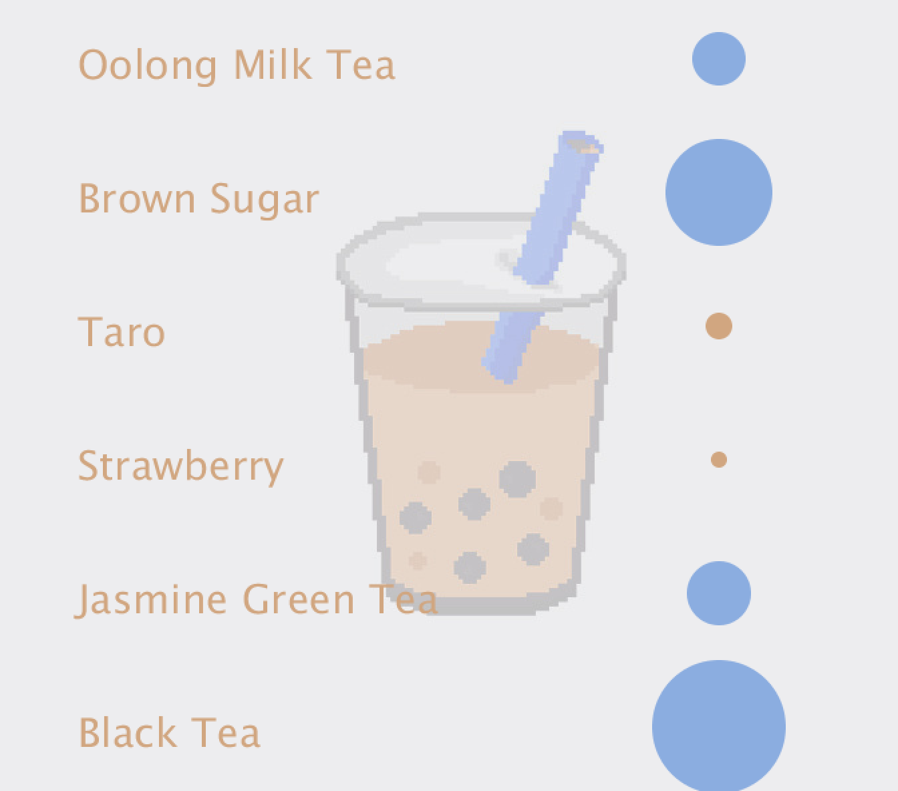
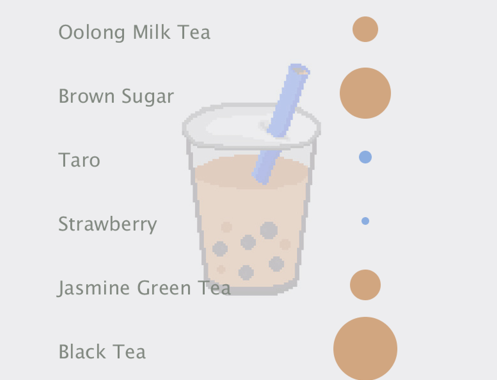
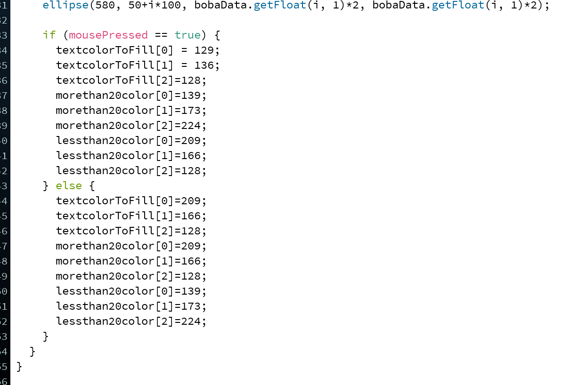
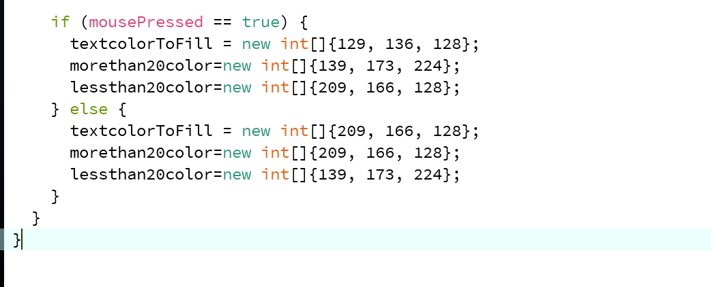

**Flavors of Boba**

For this assignment, I created a data visualization of some beloved boba flavors. Based on the amounts of vote the flavor receives, a bubble(hah!) that is porportional to the number of votes is displayed next to the flavor. The texts of the flavors and the colors of the circles changes as the mouse is pressed and released.

I used my own set of data for two reasons: 1. I couldnt find any pre-existing data set that has data on different boba flavors. 2. It is easiler to manipulate and spot errors. 

There were two main issues I ran into when designing this program. The first one is when I tried to implement the mousePress feature, it was quite cumbersome, as I typed out each member of the three RGB color codes for text, the color of bubbles for the flavors that have less than 20 votes, and the color of bubbles for the flavors that have more than 20 votes. 

I adjusted this by creating 3 empty arrays for each set of the elements that need color changes, and it looks much cleaner. 

Another issue I ran into was somehow I designed the program so that the color only changes when the mouse is pressed, but does not change back when it was released. Upon some research, I realized I was confusing mouseClicked() with mousePressed() and issue was resolved. 
