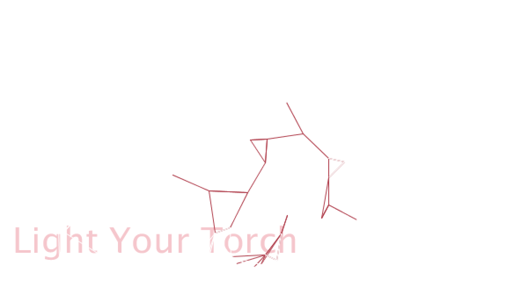
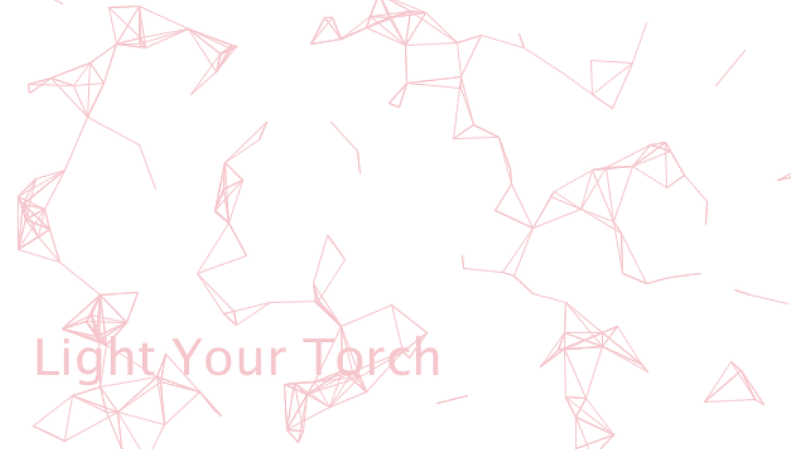

**The Torch**
For this assignment, we were asked to tweak around Aaron's example that he demonstrated in class. 
I really liked the subtleness of the emergent patterns, and wanted to bring more focus to the individual movements.
So I had the idea of a torch: the mouse moves around the screen, and wherever it moves to, the patterns emerge, like a torch in a dark cave.

Once the user presses the mouse, the whole picture of the "cave" emerges.

I also tried to play around with the code to create a gradient. I had to make the cluster of the patterns more packed to make the gradient obvious, but I didn't like the packed look. So the results are below, but the gradient effect is not shown very much 

