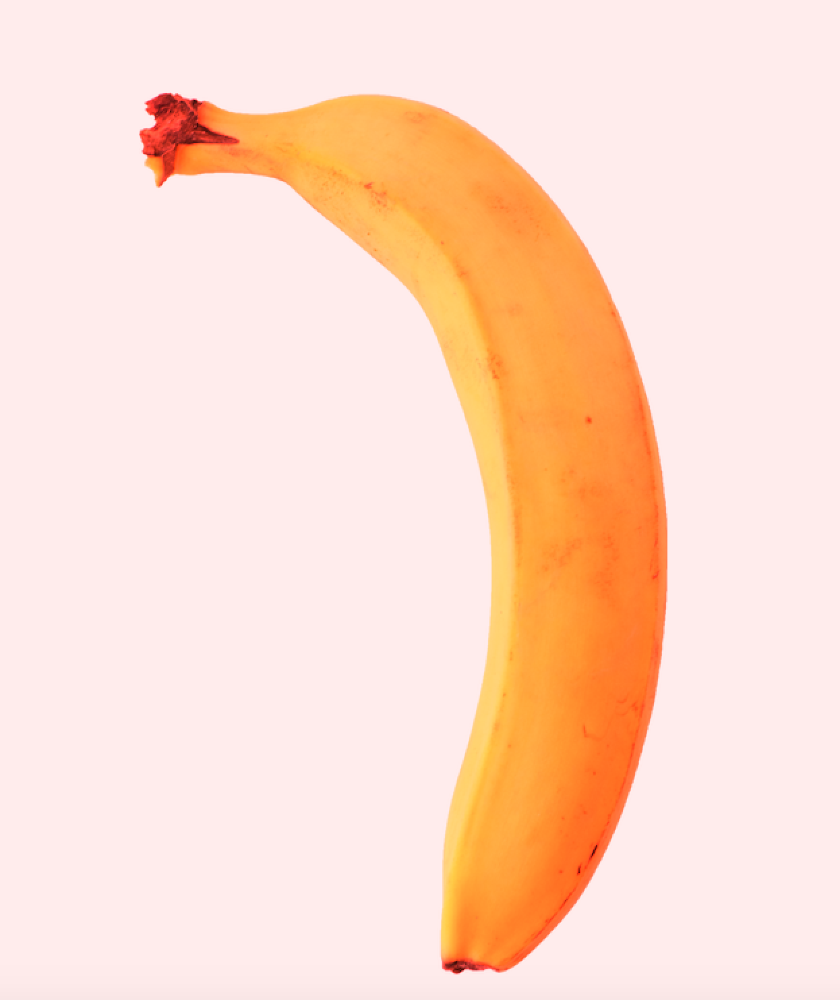
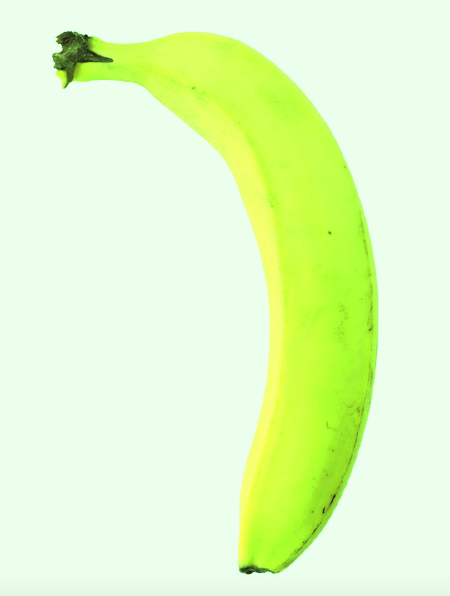
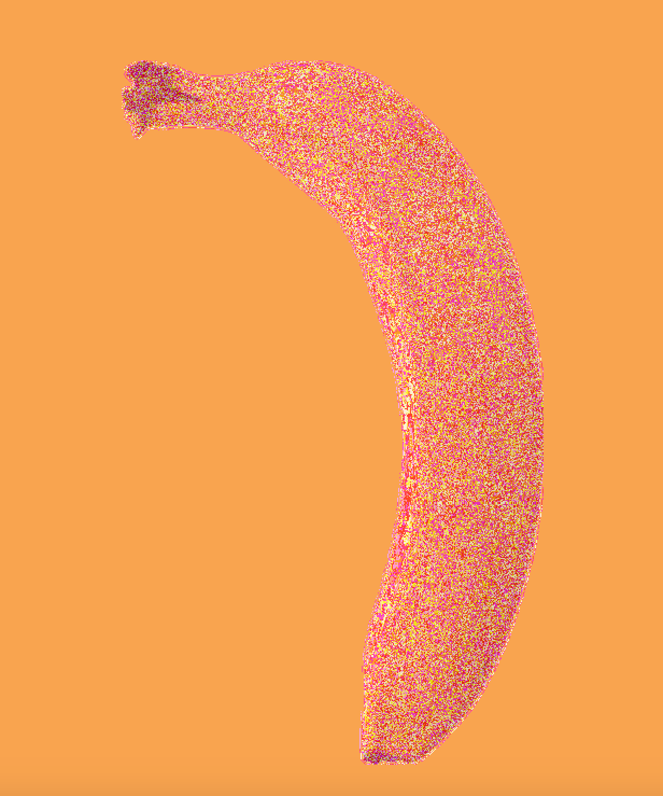
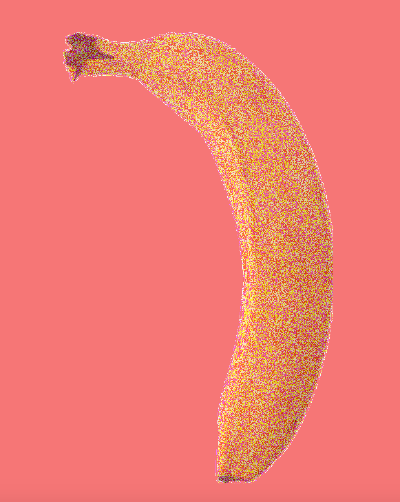

**The Velvet Underground-ish Banana**

For this assignment, I tweaked around the image of a banana. I tried to edit the image so it gives out some kind of pop-art/Andy Warhol/The Velvet Underground vibes. I mapped out the red, green, and blue pixels from the image. Through playing around with the percentage of each kind of color pixels, I was able to get some cool looking bananas. 

I also did another version of the image through not mapping out any rgb value and making changes to the pixels all together (by removing all the code about extracting the 2 kinds of color pixels and only have something like banana.pixels[location]/2). The end result was unexpected, but I like how it looks.  

