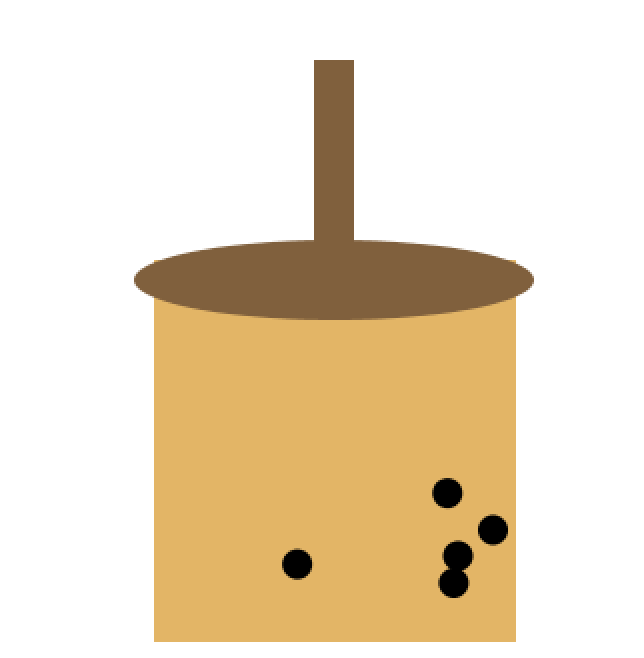

**A Small Cup of Boba**

For this assignment, I used OOP to design a cup of boba with bubbles that floats around. As a boba enthusiast, I've been making homemade bubbles and milk tea since quarantine. I was making another batch of brown sugar milk tea boba the other day, and had this idea. I implemented it through tweaking with the example we had in class to simulate the bouncy tapioca bubbles in the milk tea.

I had one issue when designing my code. Initially, I wanted the bottom edge of the boba cup to be slightly round for aesthetic purposes. However, I ran into the issue of the bubbles bouncing outside of the curved edges of the cup. I tweaked around with the program, but couldnt figure out how to make the range of the movements of bobas to be situated on a curve. I solved this prioblem by removing the curved bottom of the boba cup.

