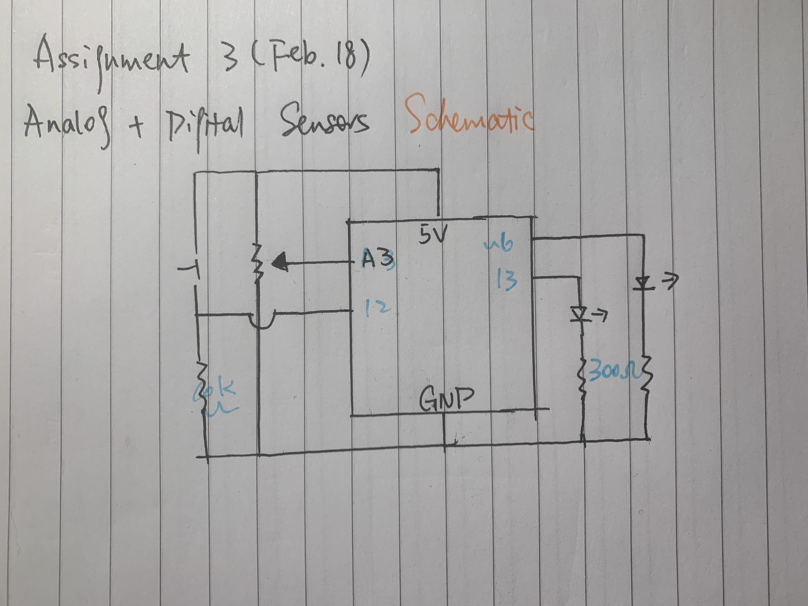
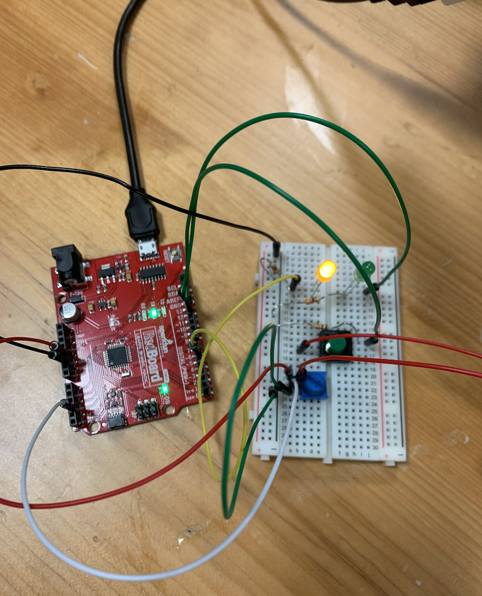

**A description of concept and how it was achieved**

For this assignment, I combined one analog sensor(a potentionmeter) and one digital sensor(a button) to control 2 LEDs. Whenever the potentionmeter is below 50% of its range, the yellow LED is turned on. Whenever it is beyond 50%, the green LED is turned on. If the green button is pressed, both LEDs will be on. 

**Schematic**

**Photograph**

**Problems, if any, and solutions, if any**

Initially I wanted to include a feature in which when the potentionmeter and the button are active at the same time, meaning the potentionmeter is being switched around and the button is pressed, both LEDs blink. However, when I try to implement that feature in my code through writing out what I want as outcomes for each possible scenario of the states of the two sensors, several things happend: 1. There would be unexpected lighting up for the LEDs when the potentionmeter is used. 2. When the green button is pressed, both LEDs are on but very dimly. I fiddled around with my code more but couldnt solve the issues, so I ended up removing that feature. 

[Here](https://www.youtube.com/watch?v=qS9syfXv_s0) is a video of my alternating LEDs in action!
