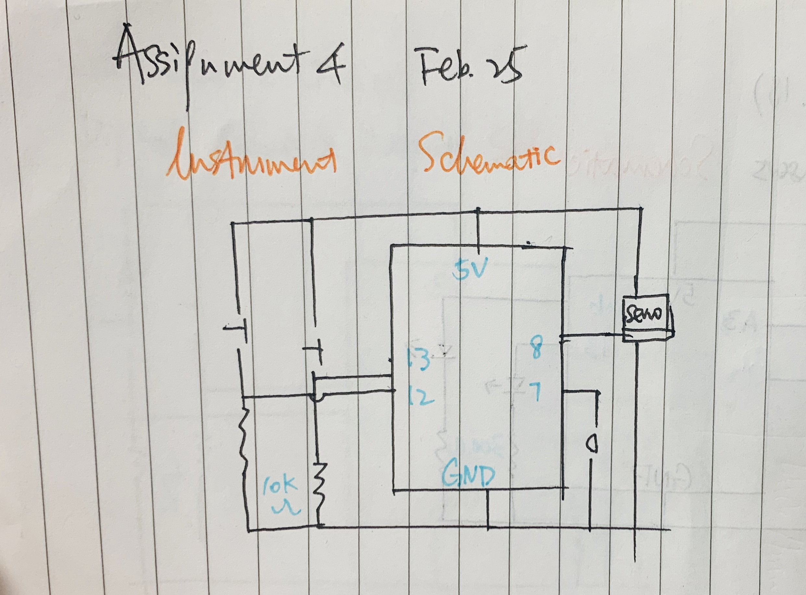
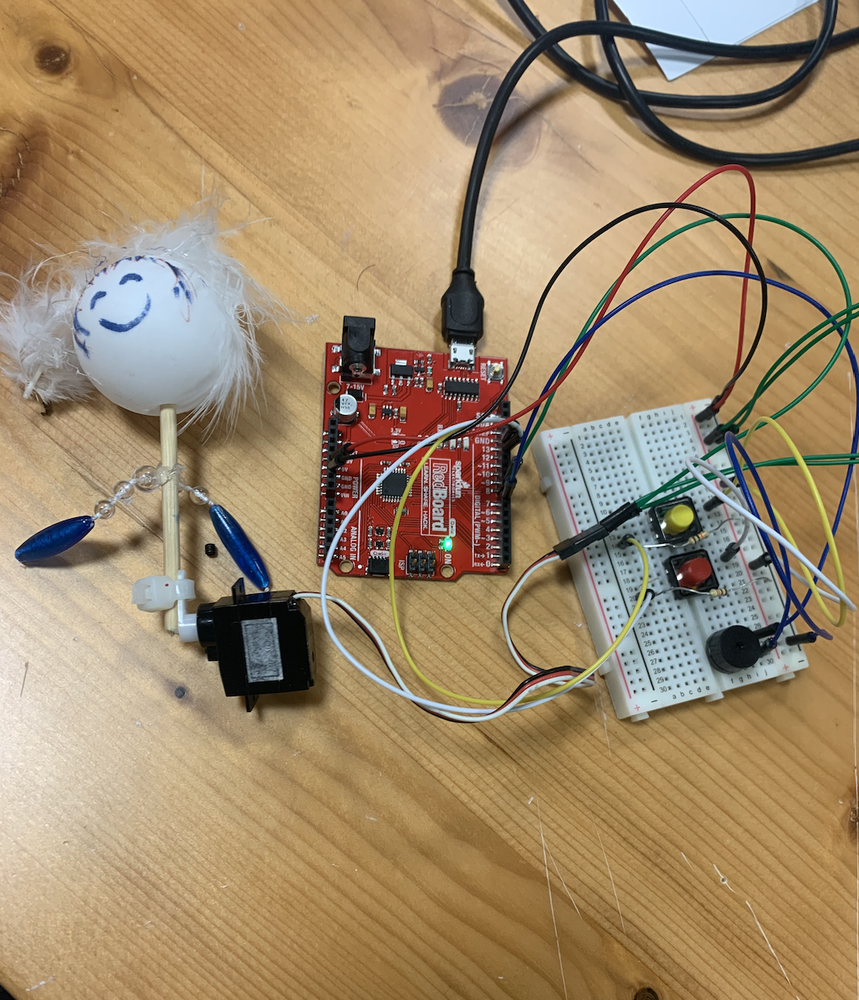

**Overall Project Concept**
  
  For assignment 4, we were asked to make a musical instrument using tone and at least one servos.I wanted to build something that has alternating melodies which incorporates interaction, meaning it requires the audience to participate, and some kind of beats.
  
**Implementation of Concept**

  I started my idea with building two swtiches and the buzzer, as they are the fundamental elements of my project and are relatively straightforward to build. Each of them corresponds to different melodies. For the yellow button, I took the melody we used in class for the buzzer exercise, tweaked it a bit, and added some other notes. For the red button, I was feeling a bit retro and used the melody for the underground theme music for Mario, which notes I found online. 

  The trickier thing now is how to use my servo motor so it will be both interactive and creating some kind of beat? I programmed the motor so that its movement activities are different for the yellow and the red button. So I need something that will reflect those differences of motions. For instpirations, I started digging in the bins in the work station of the IM lab. Initially I wanted to attach a stick to the motor, and having it hitting the side of an empty toilet paper roll. I practiced this idea, which results in a beat but its not interactive enough. Then I had the idea of attaching a ping pong ball to the stick, so the user will need to hold the stick and participate in the movement. I added a piece of feather found in the bin, drew some features to the ball, and attached a small chain of beads to the stick, and voila! A dancing queen! Not only does its presentation requires the participation of the viewer, the chain of beads creates small beats when the dancing queen is moving through hitting the tip of the motor. 

**Circuit Schematic**

**Setup**

**Problems and Solutions, Failures and Resolutions**

Half way through my project, my servo motor wasnt moving properly and it seemed like my projecting was more of a twitching queen than a dancing queen. I took two steps to solve this issue. Firstly, instead of tape, I connected the stick to the motor with a plastic attachment. Secondly, I specified in my code a narrower range of movements. Combined, there is a very secure dancing queen that dances to different melodies differently!

**Video**

[Here](https://youtu.be/blMNPb4uEAk) is a video of the dancing queen in action!
