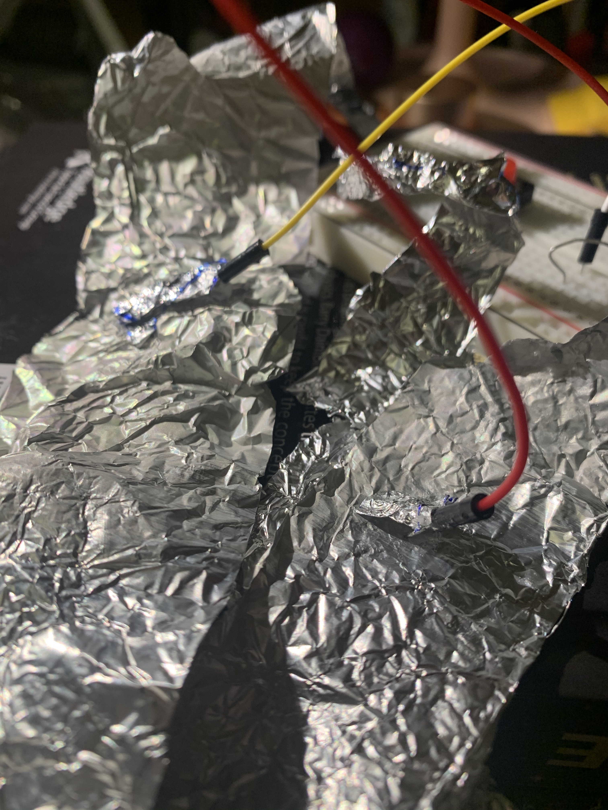

**Here is the description of my hands free switch**

For the first assignment of Introduction to Interactive Media, we were asked to design a switch that doesn’t use your hands. I’m always fascinated by super heroes evoking their powers with all different kinds of gestures. Inspired by the Hulk, I designed two bracelets made out of aluminum foil. At the center of each bracelet, one end of each wire is attached. As soon as the back of one of my wrists touch the front of the other, the two wires lead back to the Arduino board controlling the green LED light(again, Hulk inspiration), which is swtiched on.This setting allows me to develop a very stable connection, as I can press my wrists very firmly together which makes sure the swtich will work every time. 

Below is the setup of my switch
 

This is a close-up view of my swtich

