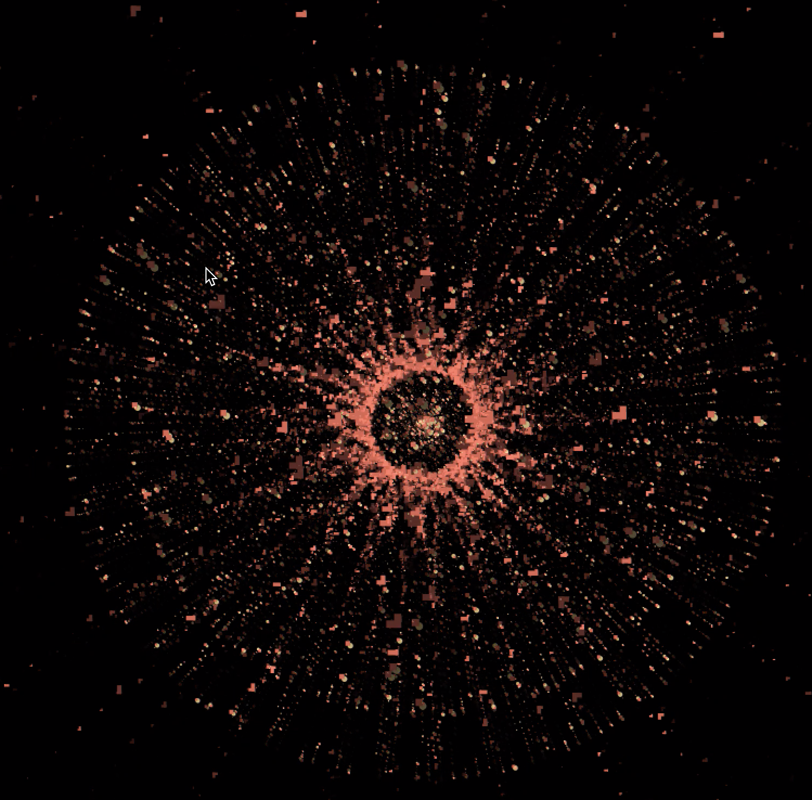
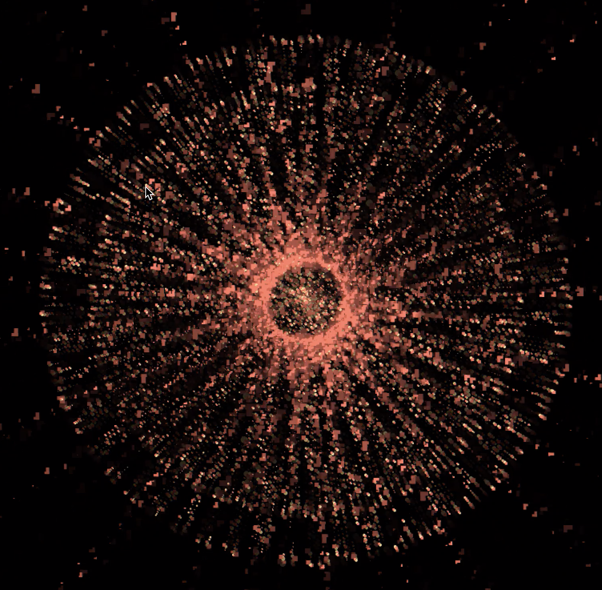
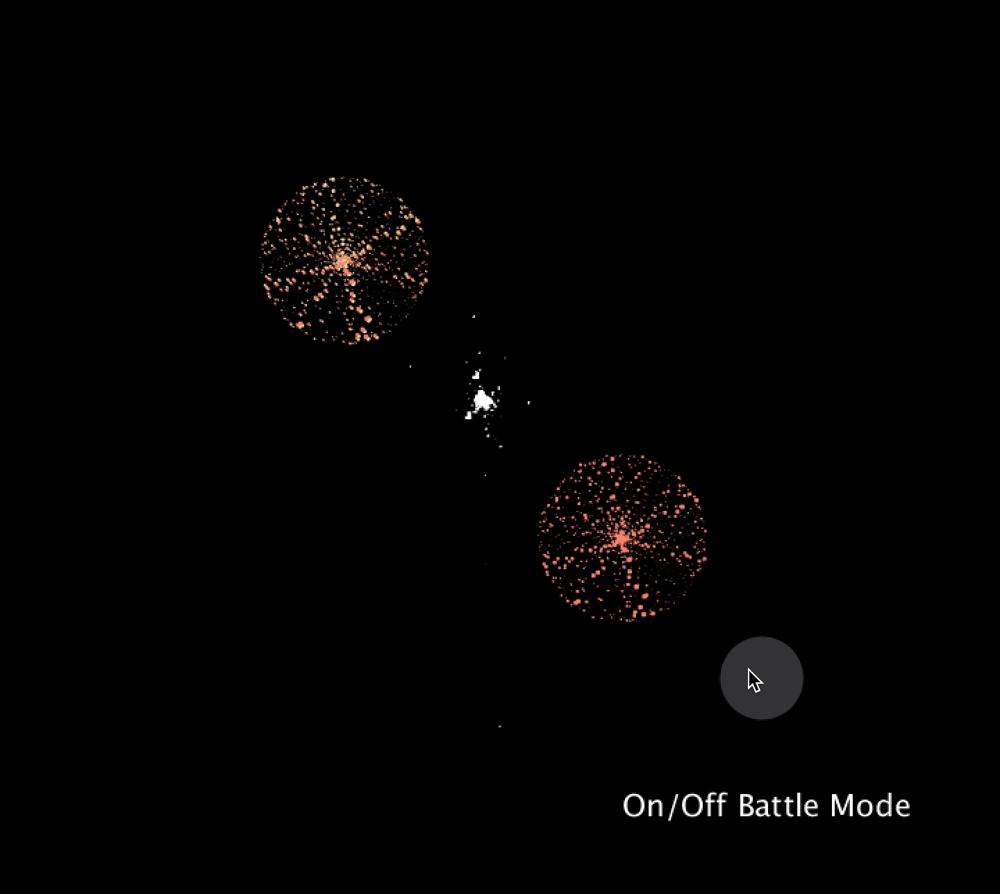
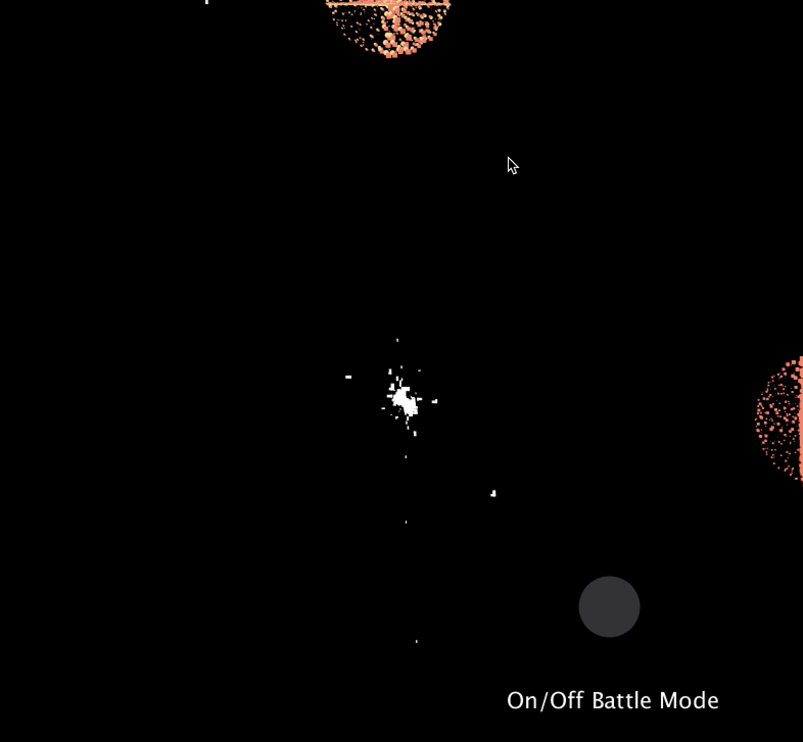
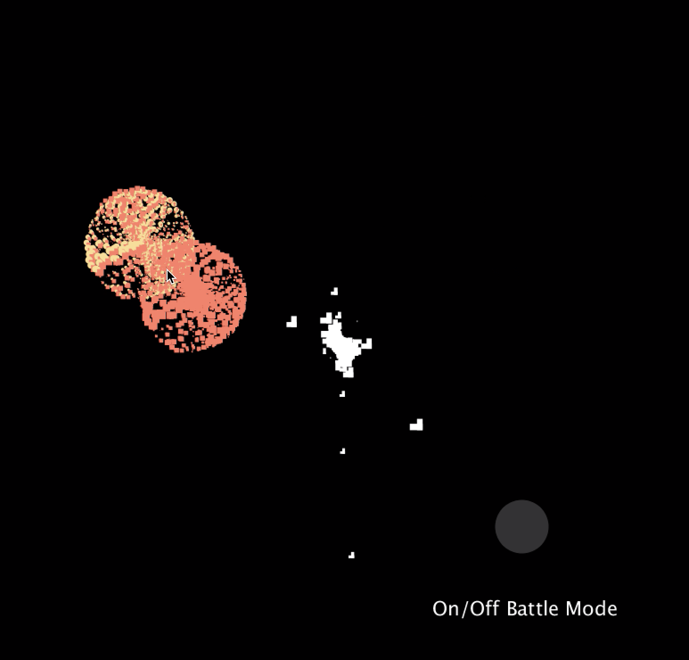

**Ambush From All Sides**

**CONCEPT**

For my final project, I wanted to visualize a classical Chinese song 十面埋伏，which translates as ambush from all sides. Tradtionally performed by the instrument Pipa, the song portrays a fierce scene in a battle scene between two armies. The beginning sections of the music focus on the description of the assembled army of the Han. The music in these sections is forceful and lively, with percussive sounds on pipa imitating drums and horns. The beat of drums gets gradually faster to depict the increasingly tense atmosphere before the onset of the battle. The main part of the music is played in a rapid manner, utilising a variety of pipa techniques to describe the furious battle between the armies of Chu and Han, such as flipping, sweeping, circular fingering, wringing, rolling, and halting. The end of the piece dipicts the defeat of the general. (https://www.youtube.com/watch?v=AAEakqIc1NM)

I hope to recreate the tenseness and structure of this piece through processing, incorporating elements that we have learned from data visualization and do some research on the side about how to visualize sounds. 

**IMPLEMENTATION**

**Phase One**

(all relavent materials can be found through downloading folder "initial")

I started the process of trying to make my concept into a program by doing some research. I found a lot resources that is about sound visualization, and I played around with some source codes. Below is the initial version that I started with. It is more of a traditional form of sound visualization, as it does not have any interactive element. It analyzes the frequency of each sound frame and presents the differences visually. 

[Here](https://youtu.be/cOKUIRFaWHE) is a video of the initial version in action. I chose to record from my phone instead of screen recording so the sound can also be included.

**Phase Two: Final Submission**

(folder "AFAS")

I was not satisfied with the end product of phase one. It just wasnt interactive enough. I decided to play around with the concept of armies in battle by creating an additional cluster of circles. Now, it looks like there are two armies fighting alone a battle line. Inspired by the doorbell example we looked at a couple weeks ago in class, I also decided to create a play/pause button. Additionally, I want the user to have the option of actually engaging in the battle through deciding where the two armies are by clicking on different areas of the screen. I like this feature because the song wanted to dipict a scene in war, which should be unpredictable and in motion. 

This is what happens if the user does not engage in the battle. The two armies just move on the opposite sides of the battle line. 

This is what happens if the user engages and clicks around the screen to make the two armies move around. 

[Here](https://youtu.be/vA-sS8JUeK8) is a video of my final submission in action. It shows both modes, user interacts and user chooses not to do anything else other than click play/pause. 

**ISSUES**

I ran into two main issues when creating my code. 

1. As soon as I implemented the play/pause button, the user engagement mode is disrupted: When the user clicks on the screen, instead of making the armies move, she pauses music. It took some tweaking around, but eventually I solved this issue through checking whether the cursor is on the button in the beginning of the code. I then created a conditional loop: the whole thing about the battle line and the armies do not happen unless the music is playing. 

2. It took me a while and some external help from a friend to make the collision functions work. The final method that I used for checking collision is actually making sure that the x and y of the battle line and two armies are always within the range of the canvas.

