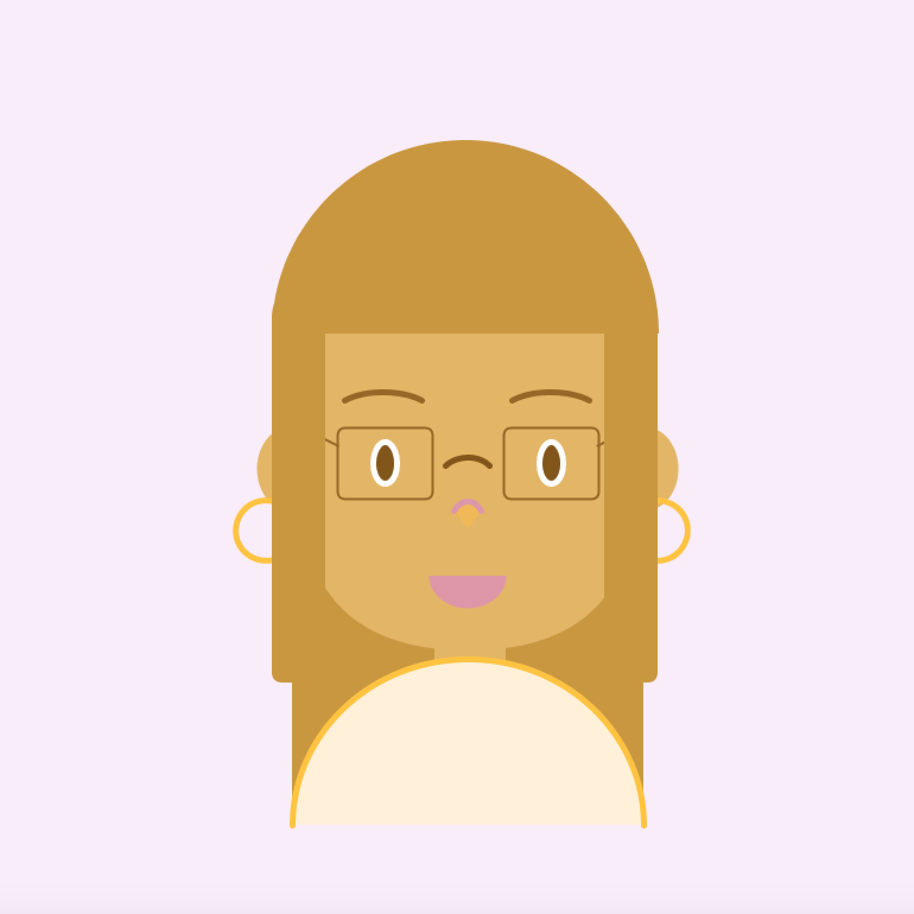

**Self-Portrait**

For this assignment, I drew a portrait of myself using Processing. I had a lot of fun creating this assignment, and I think it really helped me learning the different shapes and how to control coordinates in Processing. I also implemented a background that shifts color as the mouse moves. 

It was especially tricky to draw hair that fits with the rest of the image. I solved it by having two parts of hair: One in the background, and therefore is in the beginning of the code. Another that will cover up the head and partially cover the ears, and is at the very end of my code. 

