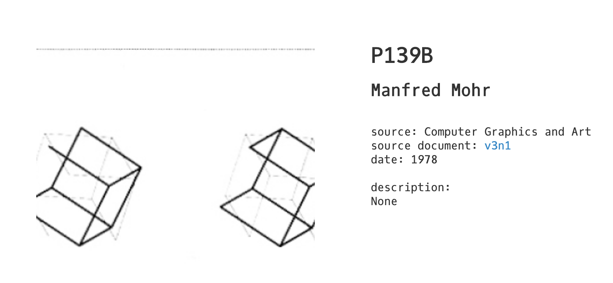
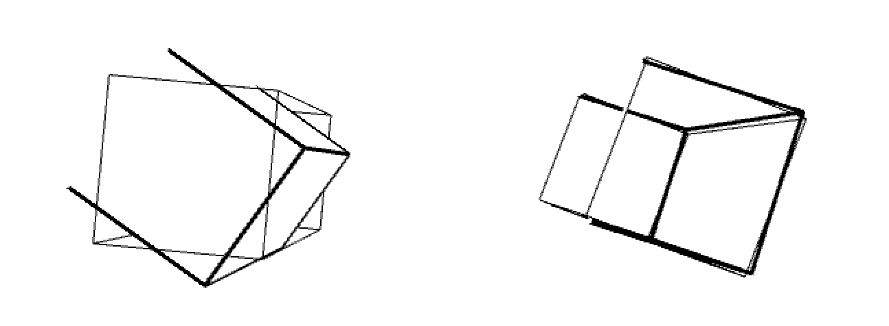
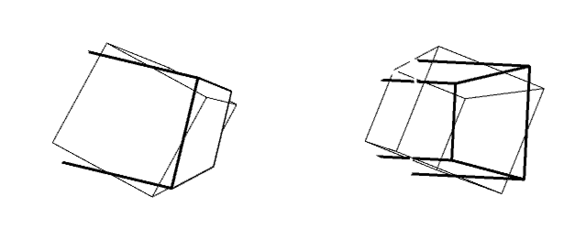
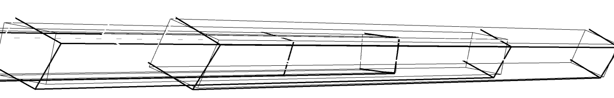

**Recreate Old Computer Art**

For this assignment, we were asked to recreate an old computer art from an issue of “Computer Graphics and Art”. Here is the image that I chose to recreate 
.

My program generates different outcomes whenver it is run. Below is an example of what it can produce.
.

There are two bugs, or, as we call them in the IM department, features of my code. 
Firstly, as illustrated below, sometimes a part of the line of the shadow cube also gets cut off. This is because sometimes the white box which I used to cover some parts of the main cube gets overlapped with the shadow cube. 

Additionally, and I am not sure why this happens, when I want to increase the amount of cubes displayed on the canvas, this happens. Honestly I think it looks quite cool, but dont really know why it happens. My guesses are because when I increase the canvas size, the potential radius of the cube gets increased, which means it would be longer. 

