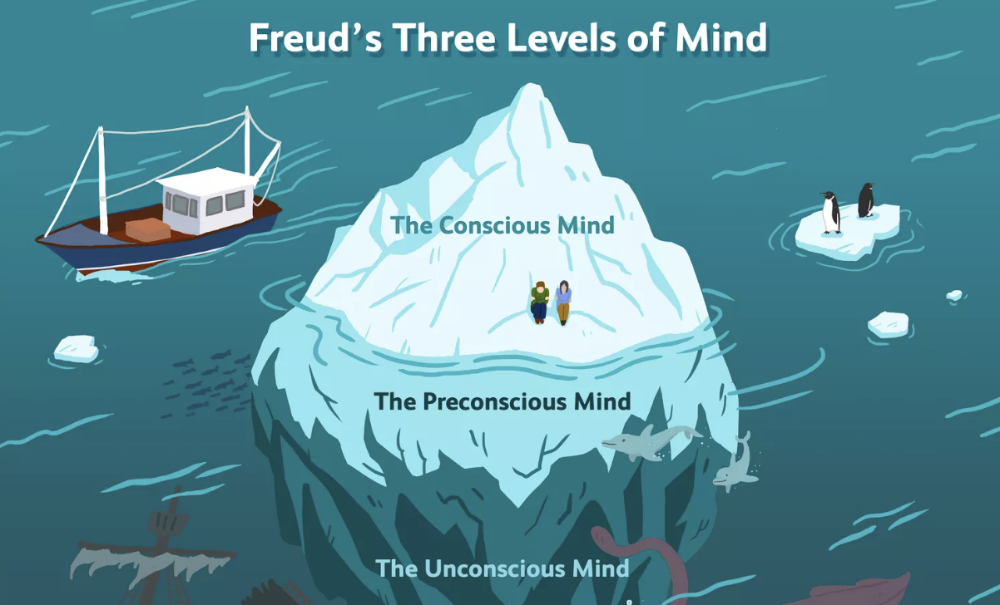

***The Iceberg of The Unconscious***

**Overall project concept**

The question of what knowledge exists in our minds always fascinates me. For my midterm project, I wanted to explore the Freudian model which describes how our minds work. The original theory describes three levels of the mind, but for this project, I'm only focusing on two of them: the conscious and the unconscious. Below is an image that gave me the inspiration to create a model of an iceberg, using multiple inputs and outputs to create a visual representation of the illuminating unconscious. 

**Description of how the circuit and the code accomplish the concept**

There are three parts to actualy implementing my concept to a concrete project. Firstly, how to construct the circuit. I knew from the very start that I would want to use quite a few LEDs and 

**Progress Documentation**

**Problems, if any, and solutions, if any**

a. the potentionmeter wasnt working properly, cuz somehow put a 10k resistor in 
b. the twitching phenomenon. fixed by two steps. A. increase the condition for fsrValue, because even when the fsr sensor isnt pressed, it is not always just on 0. B. the analogwrite function was not included in the if statement which results in all lights to be turned off. 

**Circuit schematic**

**A photograph of the overall project**

**A photograph of the electronics**

**A link to a short video**
[Here](https://youtu.be/blMNPb4uEAk) is a video of the dancing queen in action!
