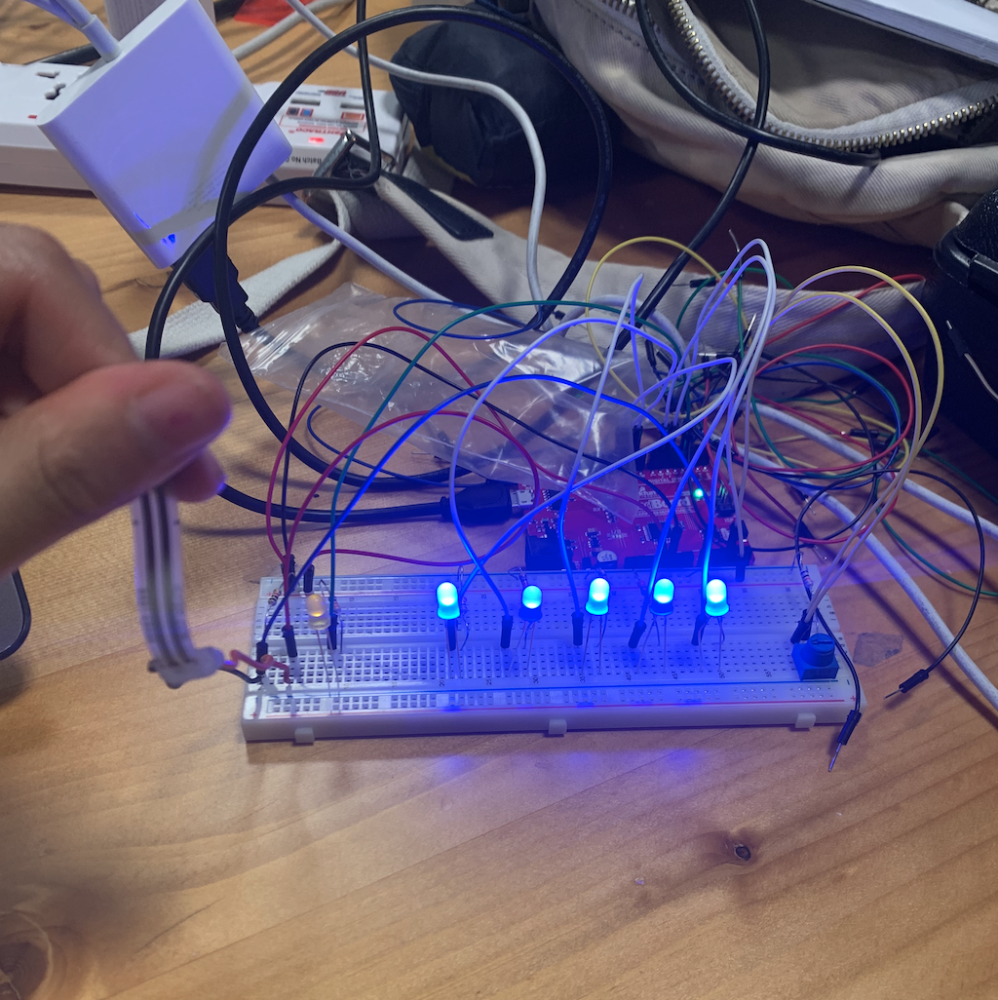

***The Iceberg of The Unconscious***

**Overall project concept**

The question of what knowledge exists in our minds always fascinates me. For my midterm project, I wanted to explore the Freudian model which describes how our minds work. The original theory describes three levels of the mind, but for this project, I'm only focusing on two of them: the conscious and the unconscious. Below is an image that gave me the inspiration to create a model of an iceberg, using multiple inputs and outputs to create a visual representation of the illuminating unconscious. 

**Description of how the circuit and the code accomplish the concept**

There are three parts to my implementation progress to turn my concept to a concrete project. Firstly, how to construct the circuit. I knew from the very start that I would want to use quite a few LEDs, so I used a bigger breadboard from the Lab instead of the regular one included in our kit. Secondly, I wanted this project to be very interactive, so I used both a fsr sensor and a potentionmeter. I had the idea of using Freud's figure, and have the user interact with it to turn on the lights. 

The last part of my project implementation was to figure out how to build a solid and stable model of the iceberg. Initially I wanted to find a big, triangular shaped plastic, and work from there. But after experimenting this idea, it cant be something of big mass and therefore wouldnt be what I want it to be. Then I had another idea: Take a relatively large piece of wood, put my breadboard and arduino on there. I'll find several satin-ish blue cloth, hold them up with several pointy sticks. the flow of the fabric will create a drop effect that will mimic the look of an iceberg. I implemented this idea, and it worked pretty well! I also came up with the idea of sticking round pieces of foam around the LEDs, so they wouldnt beam too harsh of individual lights, but a blue halo collectively. 

**Progress Documentation**

Day1, LEDs worked perfectly

initial assembly

Foam over LED for a light spectrum effect

**Problems, if any, and solutions, if any**

I ran into 2 major problems. One that was solved relatively easily, and another that took a while. 

A. I noticed that the potentionmeter wasnt working consistently. After examining my circuit, I realized a 10k resistor was placed with my potentionmeter that should not have been there. After I removed it, everything went smoothly. 

B. I ran into a twitching problem with my LEDs. Even when the fsr sensor is not pressed, all the LED lights would still be on, although very dimly. I couldnt solve this issue alone, so I asked Michael for assistance. This problem was solved by two steps. Firstly, increase the condition for fsrValue for the problem of the nose LED lightup. Because even when the fsr sensor isnt pressed, it is not always just on 0. Setting the mapping value to another single digit number, e.g., 5, solved the issue. Secondly, The analog write function was not included in the if statement that turns all the LEDs off. Meaning, all the lights will still be on even though the fsr sensor isn't pressed. After including this in the if statement, the problem of twitching was fixed. 

**Circuit schematic**

**A photograph of the overall project**

**A photograph of the electronics**

**A link to a short video**
[Here](https://youtu.be/jUSlcPs3p70) is a video of the iceberg of the Unconscious in action.
